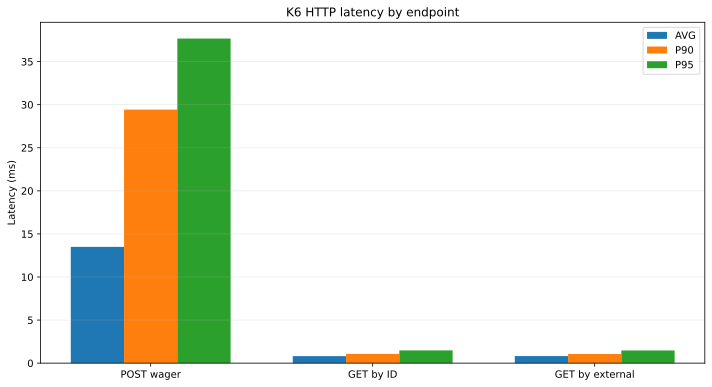
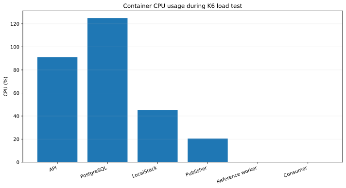
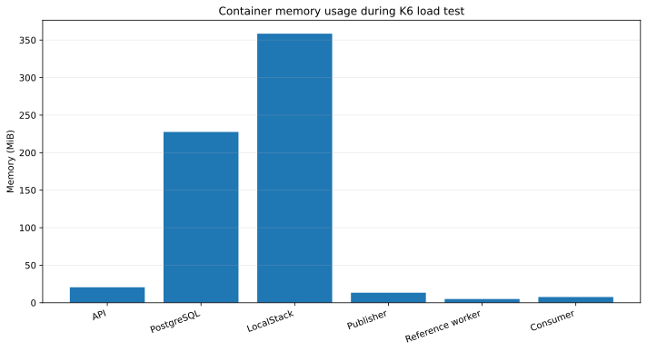
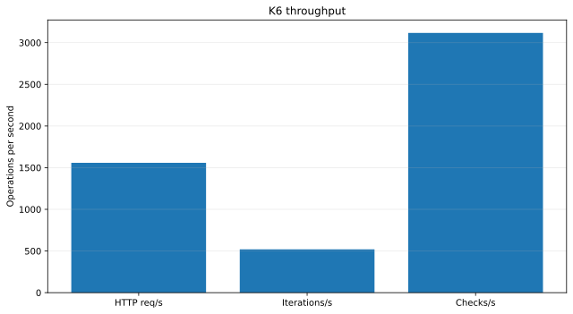

# k6 API load tests

This directory contains k6 tests for the wagering HTTP API only. Consumer, Publisher, Reference Worker, SQS and direct PostgreSQL access are outside this test scope.

## Tested flow

Each iteration performs one authenticated wagering request and then queries the same transaction through both official read endpoints:

```text
Provider token
      |
      v
POST /wagering/transactions
      |
      +--> transactionId
      +--> providerId + externalTransactionId
      |
      +--> GET /wagering/transactions/:transactionId
      |
      +--> GET /providers/:providerId/wagering/transactions/:externalTransactionId
```

The POST uses a unique `Idempotency-Key`, `externalTransactionId`, `roundId` and `gameId` on every iteration. The request amount remains a string, such as `"0.01"`, and is never represented as a floating-point value by the test payload.

## Files

```text
k6/
├── README.md
├── auth.js
├── config.js
├── profiles/
│   ├── smoke.js
│   ├── load.js
│   └── stress.js
└── scenarios/
    └── wagering-flow.js
```

- `config.js`: reads the API, Keycloak, provider, wallet and wagering variables.
- `auth.js`: obtains one provider token in the k6 `setup` phase, or reuses `PROVIDER_TOKEN` when supplied.
- `scenarios/wagering-flow.js`: shared POST and GET flow.
- `profiles/smoke.js`: one VU for a short functional load check.
- `profiles/load.js`: gradual load up to 10 VUs.
- `profiles/stress.js`: gradual stress up to 100 VUs.

## Prerequisites

Start the local stack and make sure the API is ready:

```bash
docker compose up -d
curl -i http://localhost:8080/health/ready
```

Configure the API and Keycloak token endpoint:

```bash
export API_URL="http://localhost:8080"
export TOKEN_URL="http://localhost:8081/realms/jungle/protocol/openid-connect/token"
export INTERNAL_CLIENT_ID="wallet-internal"
export INTERNAL_CLIENT_SECRET="INTERNAL_CLIENT_SECRET"
```

Generate the internal token required to create the wallet:

```bash
export INTERNAL_TOKEN="$(curl -fsS -X POST "$TOKEN_URL" \
  -H "Content-Type: application/x-www-form-urlencoded" \
  --data-urlencode "grant_type=client_credentials" \
  --data-urlencode "client_id=$INTERNAL_CLIENT_ID" \
  --data-urlencode "client_secret=$INTERNAL_CLIENT_SECRET" \
  | jq -r '.access_token')"

test -n "$INTERNAL_TOKEN" && echo "internal token ok"
```

Create a wallet through the API using the internal token. Keep the player identifier used in the request:

```bash
export WALLET_PLAYER_ID="k6-player-$(date +%s)"

curl -i -X POST "$API_URL/wallets" \
  -H "Authorization: Bearer $INTERNAL_TOKEN" \
  -H "Content-Type: application/json" \
  -d '{
    "playerId": "'"$WALLET_PLAYER_ID"'",
    "initialBalance": {
      "amount": "25.00",
      "currency": "BRL"
    }
  }'
```

Copy the `id` returned by the API and export it as `WALLET_ID`:

```bash
export WALLET_ID="<wallet-id-from-response>"
```

Query PostgreSQL to retrieve the wallet's player ID:

```bash
docker compose exec -T postgres psql \
  -U jungle \
  -d jungle \
  -c "SELECT id, player_id, balance, currency, version FROM wallets WHERE id = '$WALLET_ID';"
```

Copy the returned `player_id` and export it as `PLAYER_ID`:

```bash
export PLAYER_ID="<player-id-from-postgres>"
```

The default provider client is imported by the local Keycloak realm. The test can obtain its token automatically or use a previously generated token.

## Configuration

The defaults are suitable for the local Docker Compose stack:

```bash
export API_URL="http://localhost:8080"
export TOKEN_URL="http://localhost:8081/realms/jungle/protocol/openid-connect/token"
export PROVIDER_CLIENT_ID="provider-a"
export PROVIDER_CLIENT_SECRET="PROVIDER_CLIENT_SECRET"
export PROVIDER_ID="provider-a"
export KIND="BET"
export AMOUNT="0.01"
export CURRENCY="BRL"
```

At this point `WALLET_ID` and `PLAYER_ID` must already be exported from the wallet creation and PostgreSQL query steps above.

`WALLET_ID` and `PLAYER_ID` are required. `WALLET_IDS` and `PLAYER_IDS` can be used for a multi-wallet load test. Provide one player per wallet, in the same order, or one player value to use for every wallet:

```bash
export WALLET_IDS="wallet-id-1,wallet-id-2,wallet-id-3"
export PLAYER_IDS="player-1,player-2,player-3"
```

Use `KIND=WIN` when the purpose is sustained load without exhausting a wallet balance. Use `KIND=BET` with enough balance when measuring debit and wallet-lock contention. Business `422` rejections are tracked separately; unexpected infrastructure statuses are counted as test failures.

## Run the profiles

Run the short smoke test:

```bash
k6 run k6/profiles/smoke.js
```

Run the load profile:

```bash
k6 run k6/profiles/load.js
```

Run the stress profile against one wallet:

```bash
k6 run k6/profiles/stress.js
```

The profiles can also receive variables inline:

```bash
k6 run \
  -e API_URL="http://localhost:8080" \
  -e TOKEN_URL="http://localhost:8081/realms/jungle/protocol/openid-connect/token" \
  -e PROVIDER_CLIENT_ID="provider-a" \
  -e PROVIDER_CLIENT_SECRET="PROVIDER_CLIENT_SECRET" \
  -e WALLET_ID="$WALLET_ID" \
  -e PLAYER_ID="$PLAYER_ID" \
  -e KIND="BET" \
  -e AMOUNT="0.01" \
  k6/profiles/stress.js
```

To avoid requesting a token during setup, pass an existing token:

```bash
k6 run \
  -e PROVIDER_TOKEN="$PROVIDER_TOKEN" \
  -e WALLET_ID="$WALLET_ID" \
  -e PLAYER_ID="$PLAYER_ID" \
  k6/profiles/load.js
```

## Metrics and checks

The tests validate:

- accepted wagering status: `200`, `202` or business rejection `422`;
- returned `transactionId`;
- GET by transaction ID returns `200` and the same transaction;
- GET by provider and external transaction ID returns `200` and the same transaction;
- HTTP failure rate and endpoint latency thresholds;
- absence of unexpected infrastructure statuses.

The tests do not assert a fixed balance because the load profile may use `BET`, `WIN`, rejected operations or multiple wallets. Financial state can be inspected separately through the API and PostgreSQL procedures documented in the root README.

## Interpreting results

`422` means that the domain rejected an operation, for example because a `BET` exceeded the available balance. It is reported as a business rejection and is not an infrastructure failure.

`401`, `403`, `5xx`, missing transaction IDs and failed related GETs indicate a test or environment problem. Check the API logs and `/health/ready` before changing thresholds.

## Load Test Results

### Summary

| Metric                                        |       Result |
| --------------------------------------------- | -----------: |
| Iterations completed                          |   **62,442** |
| HTTP requests                                 |  **187,327** |
| HTTP failure rate                             |    **0.00%** |
| Checks passed                                 |  **100.00%** |
| Unexpected statuses                           |        **0** |
| POST p95                                      | **37.68 ms** |
| GET by transaction ID p95                     |  **1.48 ms** |
| GET by provider + external transaction ID p95 |  **1.47 ms** |

No high-cardinality metric warnings were produced during the run.

### Resource Usage

During the test, sampled resource usage was approximately:

| Service | CPU observed | Memory observed |
| --- | ---: | ---: |
| API | 88–93% | 20.5 MiB |
| PostgreSQL | 116 - 132% | 226 - 230 MiB |
| LocalStack | 42 - 51% | 350 - 370 MiB |
| Publisher | 19 - 23% | 13 MiB |
| Consumer | 0% | 7.7 MiB |
| Reference Worker | 0.04 - 0.10% | 5 MiB |
| Keycloak | 0.17 - 0.27% | 549 MiB |
| Swagger | 0% | 2.1 MiB |

Memory usage remained low throughout the run.

CPU values above `100%` represent usage across multiple CPU cores and are expected in the `docker stats` output.

> These values are local development measurements and should not be interpreted as production capacity targets.

## Load Test Charts

### HTTP Latency by Endpoint



### CPU Usage by Service



### Memory Usage by Service



### Throughput



### Test Volume

